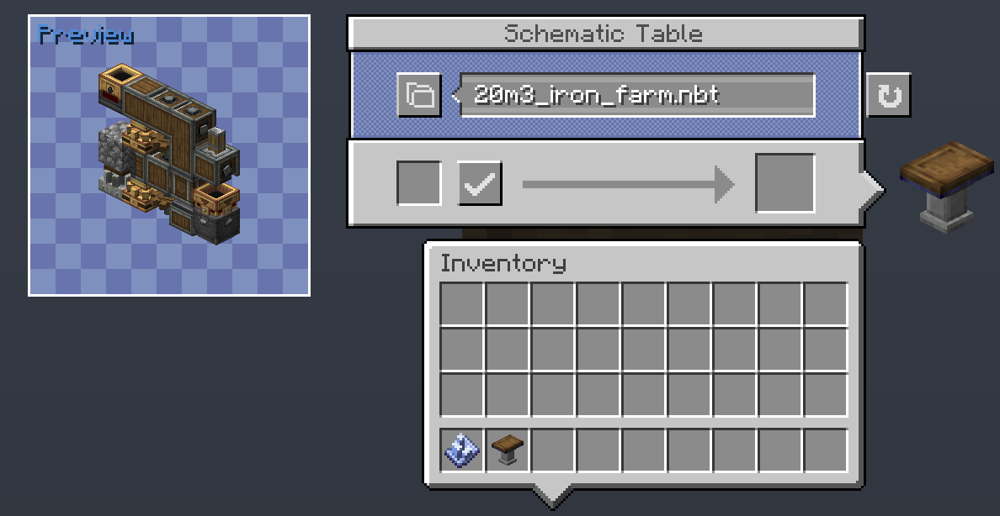
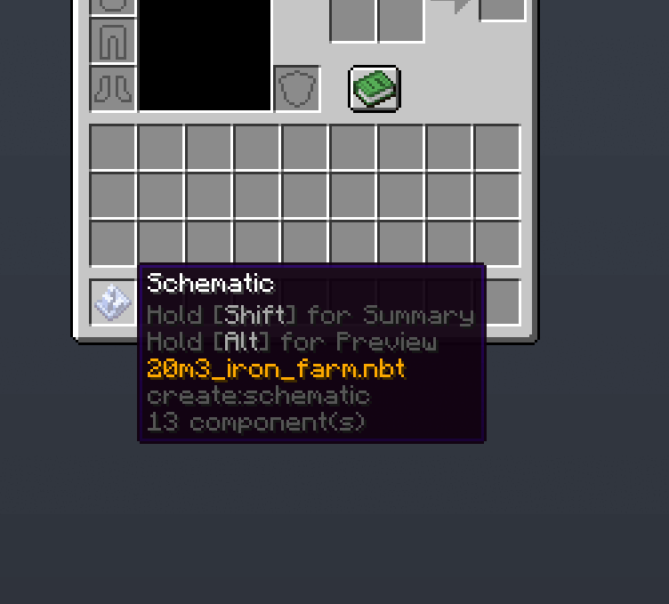

# Create: Schematic Preview

A Create addon that adds a 3D preview of your schematics inside the Schematic Table

Schematic item tooltips also support preview. Hold `Alt` while hovering a Schematic item to see it.

